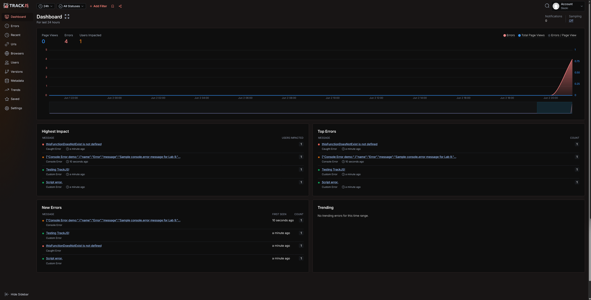

# Lab 9 - JavaScript Error Handling

Public repository: https://github.com/Slazki/Lab9_Starter

Published GitHub Pages URL: https://slazki.github.io/Lab9_Starter/

## What this demo includes

- Console method demos for `console.log`, `console.error`, `console.count`, `console.warn`, `console.assert`, `console.clear`, `console.dir`, `console.dirxml`, `console.group`, `console.groupEnd`, `console.table`, `console.time`, `console.timeEnd`, and `console.trace`.
- A calculator wrapped in `try`, `catch`, and `finally`.
- Custom errors that extend the built-in `Error` object.
- A `window.onerror` global error handler connected to the "Trigger a Global Error" button.
- TrackJS browser-agent loading with the account token from the TrackJS install page. Trigger errors in the demo, then use the TrackJS dashboard for the required screenshot.

## TrackJS screenshot

